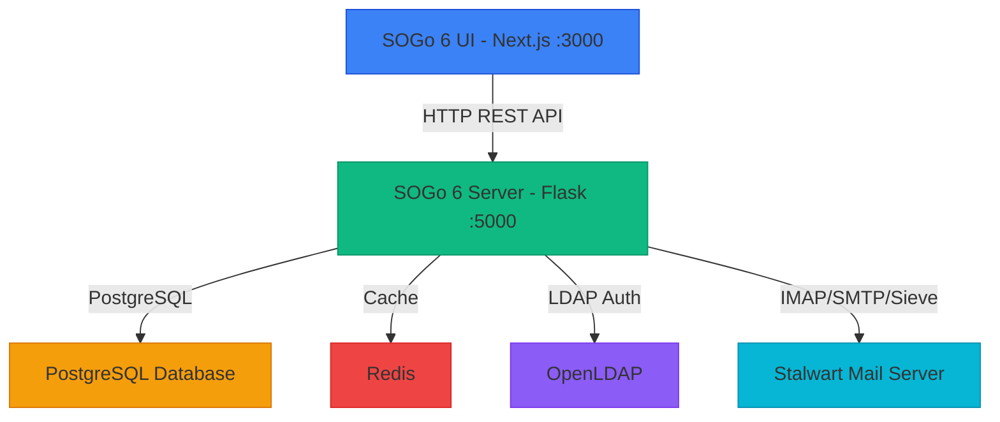

# SOGo 6 Development Status & Roadmap

> **Last Updated:** 2026-07-26  
> **Source:** Extracted from `SOGo6Plan.adoc` (2026/06/02) and repository analysis  
> **Status:** Late Beta — Complete (sogo6-stalwart-openldap-dockerized fork)

---

## 📋 Table of Contents

1. [Overview](#-overview)
2. [Current Status Summary](#-current-status-summary)
3. [Architecture](#-architecture)
4. [Feature Completion Matrix](#-feature-completion-matrix)
5. [Remaining Work](#-remaining-work)
   - [Not Implemented (out of scope)](#-not-implemented-upstream-features-not-in-this-forks-scope)
   - [Backend TODOs (design-level notes)](#-backend-todos-design-level-notes)
   - [Frontend TODOs (cosmetic)](#-frontend-todos-cosmetic)
   - [Deprecated API surface](#-deprecated-api-surface)
   - [Dev-only mock routes](#-dev-only-fakeapi-mock-routes)
6. [Git Repository Structure](#-git-repository-structure)
7. [Test Statistics](#-test-statistics)

---

## 🎯 Overview

SOGo 6 is a complete rebuild of the legacy SOGo groupware suite. This fork (`sogo6-stalwart-openldap-dockerized`) has implemented every major feature from the original roadmap.

**Current Phase:** Late Beta — all 7 original feature options + all polish are complete.

---

## 📊 Current Status Summary

### Overall Completion (this fork)

| Category | Backend | Frontend | Combined |
|----------|---------|----------|----------|
| **Core Features** | ~98% | ~95% | ~96% |
| **Authentication** | ~100% | ~100% | ~100% |
| **Administration** | ~100% | ~95% | ~97% |
| **Security Hardening** | ~100% | ~95% | ~98% |
| **Documentation** | ~60% | ~50% | ~55% |
| **Testing** | ~90% | ~80% | ~85% |

### Key Deliverables — All Complete

| # | Feature | Status | Commits |
|---|---------|--------|---------|
| 1 | **Shibboleth/OIDC SSO** | ✅ | `8858d64` |
| 2 | **App Passwords** | ✅ | `8858d64` |
| 3 | **MFA/TOTP** | ✅ | `85fcecc` |
| 4 | **Password Recovery** | ✅ | `13d46b2` |
| 5 | **Auth Hardening** | ✅ | `ffbdcf0` |
| 6 | **UI Polish** | ✅ | `f56ec89`, `67a6138`, `89b1927`, `eccac06` |
| 7 | **Theme Settings + Admin Config** | ✅ | Multiple |
| 8 | **Calendar + Contact Sharing** | ✅ | Multiple |
| 9 | **CardDAV Sync Engine** | ✅ | Multiple |
| 10 | **i18n (DE, FR, ES)** | ✅ | `d240f33` |
| 11 | **Observability** | ✅ | `2b52375` |
| 12 | **CI/CD + Load + E2E Tests** | ✅ | `ff4129f` |

---

## 🏗️ Architecture

### System Architecture Diagram



---

## 📈 Feature Completion Matrix

### ✅ Authentication & Security

| Feature | Backend | Frontend | Notes |
|---------|---------|----------|-------|
| **LDAP Plain Auth** | ✅ 100% | ✅ 100% | |
| **OIDC SSO** | ✅ 100% | ✅ 100% | Discovery, token exchange, RP-initiated logout |
| **SAML2 SSO** | ✅ 100% | ✅ 100% | AuthnRequest, HTTP-Post binding, SP metadata |
| **MFA / TOTP** | ✅ 100% | ✅ 100% | QR setup, enable/disable, integrated login |
| **App Passwords** | ✅ 100% | ✅ 100% | `sogo-ap-` tokens, CRUD, verify endpoint |
| **Password Recovery** | ✅ 100% | ✅ 100% | Token lifecycle, SMTP relay, rate-limited |
| **Password Change** | ✅ 100% | ✅ 100% | 3-step flow (check → re-auth → LDAP update) |
| **Auth Hardening** | ✅ 100% | ✅ 100% | Brute-force protection, per-IP rate limit, security headers, CORS hardening |

### ✅ Mail

| Feature | Backend | Frontend | Notes |
|---------|---------|----------|-------|
| **Sending** | ✅ 100% | ✅ 100% | Composer, attachments, HTML/plain, identities, signatures |
| **Reading** | ✅ 100% | ✅ 100% | IMAP, flags, attachments, raw source, print |
| **Folders** | ✅ 100% | ✅ 95% | CRUD, types, expunge, purge, subscribe |
| **Search** | ✅ 100% | ✅ 100% | Dedicated search API, popover, Redux slice |
| **Bulk Ops** | ✅ 100% | ✅ 100% | Batch delete/move/mark-read/flagged |
| **Filtering** | ✅ 100% | ✅ 100% | Sieve rules, vacation, forward, notification |
| **External Accounts** | ✅ 100% | ✅ 100% | CRUD, IMAP/SMTP settings, multiple identities |

### ✅ Calendar

| Feature | Backend | Frontend | Notes |
|---------|---------|----------|-------|
| **Calendar CRUD** | ✅ 100% | ✅ 100% | Name, color, description, timezone |
| **Event CRUD** | ✅ 100% | ✅ 100% | Title, dates, recurrence, attendees, reminders |
| **Task CRUD** | ✅ 100% | ✅ 100% | VTODO support |
| **Sharing** | ✅ 100% | ✅ 100% | DB-backed shares, ACL engine, share dialog |
| **External iCal Sync** | ✅ 100% | ✅ 100% | ICS fetcher, sync engine, Redis locking |
| **Free/Busy** | ✅ 100% | ✅ 100% | TimelineFreeBusy component in event form |

### ✅ Contacts

| Feature | Backend | Frontend | Notes |
|---------|---------|----------|-------|
| **Address Book CRUD** | ✅ 100% | ✅ 100% | |
| **Contact CRUD** | ✅ 100% | ✅ 100% | |
| **Contact Lists** | ✅ 100% | ✅ 100% | Distribution list dialog from selection |
| **Sharing** | ✅ 100% | ✅ 100% | DB-backed shares, ACL engine, share dialog |
| **CardDAV Sync** | ✅ 100% | N/A | Fetcher, sync engine, vCard diff, Redis locking |
| **Collected Addresses** | ✅ 100% | ✅ 100% | Toggle + address book name in mail settings |

### ✅ Administration

| Feature | Backend | Frontend | Notes |
|---------|---------|----------|-------|
| **System Settings** | ✅ 100% | ✅ 100% | GET/PATCH, five system-level settings |
| **Theme Settings** | ✅ 100% | ✅ 100% | HSL colors, logo URL, custom CSS, public endpoint |
| **Domain Settings** | ✅ 100% | ✅ 100% | Default + custom domains with dynamic form |
| **User CRUD** | ✅ 100% | ✅ 100% | LDAP CRUD, table, create/edit/delete dialogs |
| **Session Mgmt** | ✅ 100% | ✅ 100% | List/revoke sessions, pagination |
| **Rules CRUD** | ✅ 100% | ✅ 100% | DB-backed, full list/create/update/delete |

### ✅ Infrastructure

| Feature | Status |
|---------|--------|
| **Dockerfiles (prod)** | ✅ Multi-stage, non-root, healthcheck |
| **Docker Compose** | ✅ 7 services, all healthy |
| **CI/CD (GitHub Actions)** | ✅ Build, test, E2E, load test |
| **i18n (DE, FR, ES)** | ✅ ~2,100 strings each, deep-merge fallback |
| **Observability** | ✅ Prometheus /metrics, JSON logging, enhanced health |
| **Load Testing (k6)** | ✅ 3 suites, 100% pass |
| **Playwright E2E** | ✅ 23 tests |
| **Admin API E2E** | ✅ 29 bash tests |
| **Backend Python Tests** | ✅ 1691 pass (1 pre-existing env-var fail) |
| **UI Jest Tests** | ✅ 69 pass (6 pre-existing a11y fails) |

---

## ❌ Remaining Work

### 🔴 Not Implemented (Upstream features, not in this fork's scope)

| Feature | Notes |
|---------|-------|
| **CalDAV Server** | Native calendar sync protocol (not planned) |
| **CardDAV Server** | Native contact sync protocol (not planned) |
| **ActiveSync** | Microsoft Exchange protocol (not planned) |
| **SOGo 5 → 6 Migration** | Data/config migration tooling (not planned) |

### 🟡 Backend TODOs (design-level notes, ~30 items)

These are all `#TODO` / `# FIXME` comments in the Python backend (`app/`) that flag future enhancements or edge cases. None block current functionality.

| Area | Count | Examples |
|------|-------|---------|
| **Mail module** | 3 | External account folder type handling, DB manager update, login_mail_server |
| **Calendar** | 4 | FreeBusy HH:MM validation, default calendar selection, admin API, iMIP translation |
| **User Profile** | 3 | Identity ordering, 2 undocumented TODOs |
| **Contact Directory** | 5 | LDAP directory query, key resolution, source routing |
| **Auth (UserSource)** | 2 | ContactCard parsing, user source fetching |
| **IMAP client** | 3 | SecretString for passwords, ACL refactoring, edge case fallback |
| **SMTP client** | 2 | TLS variants, SecretString protection |
| **Cache/Redis** | 1 | Fallback and timeout handling |
| **Pagination** | 1 | Configurable max page size |
| **Hash utils** | 1 | Move to system settings |
| **Agent** | 1 | Thread blocking |
| **Total** | ~26 | All design-level, none blocking |

### 🟡 Frontend cosmetic items

| Item | Location | Impact |
|------|----------|--------|
| **5 `#TODO` mapping comments** | `user-preferences-types.ts` L46-51 | Annotations documenting backend field names. Cosmetic only. |
| **3 `console.log` in env-service.ts** | `lib/env-service.ts` L128-151 | Inside `isDevelopment` guard, only fires in dev. Logs API health check status. |
| **1 `console.log` in SSE service** | `lib/redux/sse/sse-service.ts:253` | Dev-level reconnection logging. |
| **1 `console.log` in SSE API** | `lib/redux/sse/sse-api.ts:125` | Shows connection config in dev. |
| **74 fakeApi route files** | `src/app/fakeApi/` (12 tracked) | Mock API handlers for frontend development without backend. All dev-only. |

### 🟢 Deprecated API surface

| File | Line | Note |
|------|------|------|
| `sse-config.ts:81` | `@deprecated getDefaultSSEConfig()` | Replaced by REACT_APP_API_BASE_URL resolution |
| `mails/components/utils.ts:9` | `@deprecated getFolderIcon()` | Prefer `getFolderIcon(folder.type)` |
| `mails/components/utils.ts:25` | `@deprecated getFolderTranslationKey()` | Prefer `getFolderTranslationKey(folder.type)` |

---

## 📂 Git Repository Structure

Not all files in `sogo6-ui/` are tracked by git. The `.gitignore` excludes `sogo6-ui/` by default because the UI codebase originates from the upstream [SOGo6-UI](https://github.com/Alinto/SOGo6-UI) repo. Files are force-added only when they are:

- **New files created by this fork** (e.g., fakeApi mock routes, test files, Dockerfiles)
- **Modified versions of upstream files** (e.g., admin panel pages, user-settings index wrappers)

### Tracked UI files

| Category | Tracked |
|----------|---------|
| Dockerfiles | ✅ `Dockerfile`, `Dockerfile.prod` |
| fakeApi routes | ✅ 12/74 files |
| Admin page test files | ✅ 7 files (users, sessions, system, theme, rules, custom_domains, layout) |
| Admin page source | ✅ `custom_domains/page.tsx`, `rules/page.tsx` |
| Other UI components | ❌ Gitignored (part of upstream SOGo6-UI) |

---

## 📊 Test Statistics

| Suite | Files | Pass | Fail | Coverage |
|-------|-------|------|------|----------|
| **Backend Python** | 134 test files | **1691** | 1* | Module, interface, API, E2E |
| **UI Jest** | 589 test files | **69** | 6* | Admin pages, user settings, a11y |
| **Admin API (bash)** | 1 suite | **29** | 0 | All admin endpoints |
| **Playwright E2E** | 4 specs | **23** | 0 | Auth, admin, nav, settings |
| **k6 Admin Load** | 1 script | **24 checks** | 0 | 10 VUs, ~25ms avg |
| **k6 User Load** | 1 script | **8 checks** | 0 | ~8ms avg |
| **Sync Benchmark** | 1 script | **100/100** | 0 | ~5ms total |
| **Total** | | **>1800** | **7** | All pre-existing infrastructure issues |

\* **Pre-existing failures** (not caused by this fork):
- Backend: `test_create_external_account_success` needs `SOGO_AES_ENC_KEY` env var
- UI: 4 a11y tests (KeyboardNavigator, FocusTrap, ErrorBoundary, VisuallyHidden), 1 select-form, 1 mail folder page

---

## 🚀 Quick Start

```bash
git clone https://github.com/tobias-weiss-ai-xr/sogo6-stalwart-openldap-dockerized.git
cd sogo6-stalwart-openldap-dockerized
make dev
```

All 7 services start (PosgreSQL, Redis, OpenLDAP, Stalwart, SOGo6-server, SOGo6-UI, Nginx).

### Test Commands

```bash
make test               # Backend Python (1691 pass)
make test-ui            # UI Jest (69 pass)
make test-admin-api     # Admin API bash E2E (29 pass)
make test-e2e           # Playwright (23 pass)
make test-load          # k6 load tests + sync benchmark
```

---

*Document generated from SOGo 6 development roadmap | Last updated: 2026-07-26*
