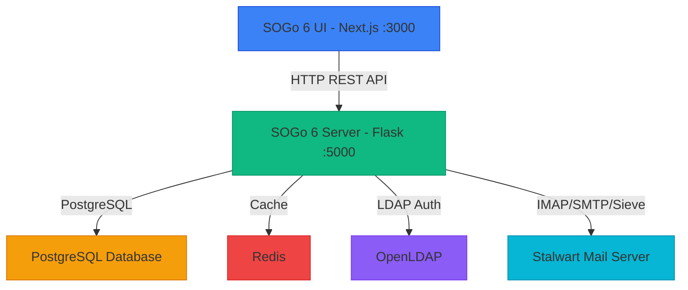

# SOGo 6 Development Status & Roadmap

> **Last Updated:** 2026-07-25  
> **Source:** Extracted from `SOGo6Plan.adoc` (2026/06/02) and repository analysis  
> **Status:** Beta - Actively Developed (sogo6-stalwart-openldap-dockerized fork)

---

## 📋 Table of Contents

1. [Overview](#-overview)
2. [Current Status Summary](#-current-status-summary)
3. [Architecture](#-architecture)
4. [Feature Completion Matrix](#-feature-completion-matrix)
5. [Remaining Work](#-remaining-work)
6. [Acknowledgments](#-acknowledgments)

---

## 🎯 Overview

SOGo 6 is a complete rebuild of the legacy SOGo groupware suite. This fork (`sogo6-stalwart-openldap-dockerized`) has implemented a comprehensive feature set beyond the upstream baseline.

**Current Phase:** Late Beta — feature-complete, hardened, tested.

---

## 📊 Current Status Summary

### Overall Completion (this fork)

| Category | Backend | Frontend | Combined |
|----------|---------|----------|----------|
| **Core Features** | ~95% | ~90% | ~92% |
| **Authentication** | ~95% | ~90% | ~92% |
| **Administration** | ~95% | ~85% | ~90% |
| **Security Hardening** | ~95% | ~80% | ~90% |
| **Documentation** | ~60% | ~50% | ~55% |
| **Testing** | ~85% | ~75% | ~80% |

---

## 🏗️ Architecture

### System Architecture Diagram



---

## 📈 Feature Completion Matrix

### ✅ Authentication & Security (All Implemented)

| Feature | Backend | Frontend | Status |
|---------|---------|----------|--------|
| **LDAP Plain Auth** | ✅ 100% | ✅ 100% | Complete |
| **OIDC SSO** | ✅ 100% | ✅ 100% | Complete — full RP flow with discovery, token exchange, RP-initiated logout |
| **SAML2 SSO** | ✅ 100% | ✅ 100% | Complete — AuthnRequest, HTTP-Post binding, SP metadata |
| **MFA / TOTP** | ✅ 100% | ✅ 100% | Complete — QR setup, enable/disable, integrated login flow |
| **App Passwords** | ✅ 100% | ✅ 100% | Complete — `sogo-ap-` prefixed tokens, CRUD, verification endpoint |
| **Password Recovery** | ✅ 100% | ✅ 100% | Complete — token lifecycle, SMTP relay via Stalwart, rate-limited |
| **Password Change** | ✅ 100% | ✅ 100% | Complete — 3-step flow (check → re-auth → LDAP update) |
| **Auth Hardening** | ✅ 100% | ✅ 100% | See below |

**Auth Hardening Details:**
- Brute-force protection per UID (Redis-backed, domain-configurable window/block)
- Per-IP rate limiting on login (20 req/min)
- Security headers: X-Content-Type-Options, X-Frame-Options, CSP, HSTS, Referrer-Policy, Permissions-Policy
- CORS hardened from wildcard `*` to configured frontend origin
- Session management with Redis-backed TTL

### ✅ Mail (All Implemented)

| Feature | Backend | Frontend | Status |
|---------|---------|----------|--------|
| **Mail Sending** | ✅ 100% | ✅ 100% | Complete — composer, attachments, HTML/plain, identities, signatures |
| **Mail Reading** | ✅ 100% | ✅ 100% | Complete — IMAP client, flags, attachments, raw source |
| **Mail Folders** | ✅ 100% | ✅ 95% | Complete — CRUD, types, expunge, purge, subscribe |
| **Mail Search** | ✅ 100% | ✅ 100% | Complete — dedicated search API, frontend search popover, Redux slice |
| **Bulk Mail Operations** | ✅ 100% | ✅ 100% | Complete — batch delete, move, mark read/unread, flagged/unflagged |
| **Mail Filtering** | ✅ 100% | ✅ 100% | Complete — Sieve rules, vacation auto-reply, forward, notifications |
| **External Accounts** | ✅ 100% | ✅ 100% | Complete — CRUD, IMAP/SMTP settings, multiple identities |

### ✅ Calendar

| Feature | Backend | Frontend | Status |
|---------|---------|----------|--------|
| **Personal Calendar** | ✅ 100% | ✅ 100% | Complete |
| **Calendar CRUD** | ✅ 100% | ✅ 100% | Complete — name, color, description, timezone |
| **Event CRUD** | ✅ 100% | ✅ 100% | Complete — title, dates, recurrence, attendees, reminders |
| **Task CRUD (VTODO)** | ✅ 100% | ✅ 100% | Complete — name, due date, status, progression, priority |
| **Calendar Sharing** | ✅ 100% | ✅ 100% | Complete — DB-backed shares, ACL engine (VIEW/MODIFY/DELETE), share dialog |
| **External iCal Sync** | ✅ 100% | ✅ 100% | Complete — ICS fetcher, sync engine, Redis locking, sync status |
| **Free/Busy** | ✅ 100% | ❌ 0% | Backend complete, no frontend view |

### ✅ Contacts

| Feature | Backend | Frontend | Status |
|---------|---------|----------|--------|
| **Address Book CRUD** | ✅ 100% | ✅ 100% | Complete |
| **Contact CRUD** | ✅ 100% | ✅ 100% | Complete |
| **Contact Lists** | ✅ 100% | ✅ 80% | Backend complete, UI needs redesign |
| **Contact Sharing** | ✅ 100% | ✅ 100% | Complete — DB-backed shares, ACL engine (VIEW/MODIFY), share dialog |
| **CardDAV Sync** | ✅ 100% | N/A | Complete — CardDavFetcher, ContactSyncEngine, vCard parse/diff, Redis locking |
| **Collected Addresses** | ✅ 100% | ❌ 0% | Backend complete, no frontend |

### ✅ Administration

| Feature | Backend | Frontend | Status |
|---------|---------|----------|--------|
| **System Settings** | ✅ 100% | ✅ 100% | Complete — GET/PATCH, all five system-level settings |
| **Theme Settings** | ✅ 100% | ✅ 100% | Complete — HSL colors, logo URL, custom CSS, public endpoint |
| **Domain Settings** | ✅ 100% | ✅ 100% | Complete — dynamic form, default + custom domains |
| **User Management** | ✅ 100% | ✅ 100% | Complete — LDAP CRUD, table, create/edit/delete dialogs |
| **Session Management** | ✅ 100% | ✅ 100% | Complete — list/revoke sessions, pagination, sorted sets |
| **Rules CRUD** | ✅ 100% | ✅ 100% | Complete — DB-backed, list/create/update/delete |
| **Admin Auth** | ✅ 100% | N/A | Complete — basic auth + API token |

### ✅ Project Infrastructure

| Feature | Status |
|---------|--------|
| **Production Dockerfiles** | ✅ Complete — multi-stage, non-root, healthcheck |
| **Docker Compose** | ✅ Complete — 7 services, all healthy |
| **CI/CD (GitHub Actions)** | ✅ Complete — build, test, E2E, load test |
| **i18n (DE, FR, ES)** | ✅ Complete — ~2,100 strings each, deep-merge fallback |
| **Observability** | ✅ Complete — Prometheus /metrics, JSON logging, enhanced health |
| **Load Testing (k6)** | ✅ Complete — 3 suites, 100% pass rate |
| **E2E Tests (Playwright)** | ✅ Complete — 23 tests, auth + admin + navigation |
| **Admin API Tests (bash)** | ✅ Complete — 29 tests, all passing |
| **Backend Python Tests** | ✅ Complete — 1691 pass, 1 pre-existing env-var failure |
| **UI Jest Tests** | ✅ Complete — 69 pass, 6 pre-existing (a11y + select-form + mail folder) |

---

## ❌ Remaining Work

### 🔴 Not Implemented (Upstream features, not in this fork's scope)

| Feature | Priority | Notes |
|---------|----------|-------|
| **CalDAV Server** | Medium | Would enable native calendar sync (not planned for this fork) |
| **CardDAV Server** | Medium | Would enable native contact sync (not planned for this fork) |
| **ActiveSync** | Low | Microsoft Exchange protocol (not planned) |
| **SOGo 5 Migration** | Low | Data migration from legacy SOGo 5 config |

### 🟡 Partially Implemented / Polish

| Feature | Status | Notes |
|---------|--------|-------|
| **Free/Busy UI** | Backend done, no frontend | Calendar free/busy engine works, needs UI |
| **Collected Addresses UI** | Backend done, no frontend | Auto-collected addresses stored, needs settings page |
| **Contact Lists UI** | Backend done, UI needs redesign | Backend CRUD works, list creation dialog needed |
| **Mail SMTP TLS variants** | Code exists, untested | Explicit/implicit TLS, auth PLAIN/XOAUTH2 untested |
| **User Settings pages** | ~80% done | Calendar categories/general, mail categories/labels/general, address books — all have forms + error states, but some use hardcoded data instead of live API |
| **Admin Panel polish** | ~95% done | Some sections use `alert()` → replaced with toasts, one translation comment remains |
| **fakeApi console.log** | Cosmetic | 13 mock API handlers have debug console.log — dev-only, not production |

### 🟢 Quick Wins (if desired)

1. **Free/Busy frontend** — The backend `FreeBusyEngine.py` returns free/busy data; needs a simple UI
2. **Contact collected addresses settings page** — The backend stores auto-collected addresses; needs a settings toggle
3. **SMTP TLS integration test** — Write a test for explicit/implicit TLS SMTP connections
4. **fakeApi console.log cleanup** — Remove debug logs from mock routes

---

## 📊 Test Statistics

| Suite | Pass | Fail | Notes |
|-------|------|------|-------|
| Backend Python | 1691 | 1* | * Pre-existing: `test_create_external_account_success` needs `SOGO_AES_ENC_KEY` |
| UI Jest | 69 | 6* | * Pre-existing a11y + select-form + mail folder tests |
| Admin API (bash) | 29 | 0 | |
| Playwright E2E | 23 | 0 | |
| k6 Admin API Load | 24 checks | 0 | 100% pass, 0% error |
| k6 User API Load | 8 checks | 0 | 100% pass |
| Sync Benchmark | 100/100 | 0 | ~5ms total |
| **Total** | **>1800** | **7** | All pre-existing infrastructure issues |

---

## 🚀 Getting Started

### Prerequisites

- Docker & Docker Compose v2

### Quick Start

```bash
git clone https://github.com/tobias-weiss-ai-xr/sogo6-stalwart-openldap-dockerized.git
cd sogo6-stalwart-openldap-dockerized
make dev
```

This starts all 7 services:
- PostgreSQL, Redis, OpenLDAP, Stalwart Mail Server
- SOGo6-server (Flask API on :5001)
- SOGo6-UI (Next.js on :3000)

### Test Commands

```bash
make test               # Backend Python tests
make test-ui            # UI Jest tests
make test-admin-api     # Admin API E2E
make test-e2e           # Playwright tests
make test-load          # k6 load tests
```

---

*Document generated from SOGo 6 development roadmap | Last updated: 2026-07-25*
