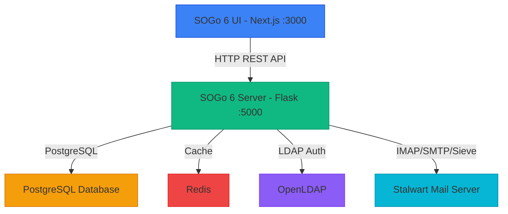

# SOGo 6 Development Status & Roadmap

> **Last Updated:** 2026-07-25  
> **Source:** Extracted from `SOGo6Plan.adoc` (2026/06/02) and repository analysis  
> **Status:** Alpha - Active Development

---

## 📋 Table of Contents

1. [Overview](#-overview)
2. [Current Status Summary](#-current-status-summary)
3. [Architecture](#-architecture)
4. [Feature Completion Matrix](#-feature-completion-matrix)
5. [Roadmap Details](#-roadmap-details)
   - [Public and Community](#public-and-community)
   - [Installation, Deployment, Update](#installation-deployment-update)
   - [Robustness](#robustness)
   - [Documentation](#documentation)
   - [Migration SOGo 5 to 6](#migration-sogo-5-to-6)
   - [SOGo 6 Features](#sogo-6-features)
6. [Contribution Opportunities](#-contribution-opportunities)
7. [Getting Started](#-getting-started)

---

## 🎯 Overview

SOGo 6 is a **complete rebuild** of the legacy SOGo groupware suite with modern technologies:

- **Frontend (SOGo6-UI):** Next.js 16, React 19, TypeScript, Tailwind CSS
- **Backend (SOGo6-server):** Python 3.10+, Flask, PostgreSQL, Redis
- **Mail Backend:** Stalwart Mail Server (IMAP/SMTP/Sieve)
- **Authentication:** OpenLDAP (SQL user sources planned)

**Current Phase:** Alpha - Not production ready

**Repositories:**
- [Alinto/SOGo6-server](https://github.com/Alinto/SOGo6-server) - Flask API Backend
- [Alinto/SOGo6-UI](https://github.com/Alinto/SOGo6-UI) - Next.js Frontend

---

## 📊 Current Status Summary

### Overall Completion

| Category | Backend | Frontend | Combined |
|----------|---------|----------|----------|
| **Core Features** | ~70% | ~60% | ~65% |
| **Authentication** | ~30% | ~50% | ~40% |
| **Administration** | ~40% | ~20% | ~30% |
| **Documentation** | ~15% | ~15% | ~15% |
| **Installation** | ~50% | ~50% | ~50% |
| **Testing** | ~20% | ~20% | ~20% |

### Key Statistics

- **Total Features Tracked:** ~500+ items
- **100% Complete:** ~150 features
- **0% Complete (Not Started):** ~200 features
- **Partially Complete:** ~150 features

---

## 🏗️ Architecture

### System Architecture Diagram



### Project Structure

**SOGo6-server (Backend):**
```
app/
├── auth/           # Authentication methods (LDAP, future: OpenID, SAML)
├── calendar/       # Calendar functionality (events, tasks, journals)
├── config/         # Configuration and settings management
├── contacts/       # Contacts and address books
├── mail/           # Mail functionality (IMAP client, SMTP client)
├── models/         # Database models (SQLAlchemy)
├── user/           # User API endpoints
└── admin/          # Admin API endpoints
```

**SOGo6-UI (Frontend):**
```
src/
├── app/            # Next.js app router pages
├── components/     # Reusable UI components
├── features/       # Feature-specific components (mail, calendar, contacts)
├── lib/            # Utility functions and API services
├── styles/         # CSS and styling
└── types/          # TypeScript type definitions
```

---

## 📈 Feature Completion Matrix

### ⭐ High Priority Features (Critical for Alpha Release)

| Feature Category | Backend | Frontend | Status | Notes |
|-----------------|---------|----------|--------|-------|
| **Core Startup** | ✅ 100% | ✅ 100% | Complete | Process settings, DB connection, cache |
| **Basic Auth** | ✅ 100% | ✅ 80% | Mostly Complete | LDAP auth works, 2-step login UI |
| **Mail Sending** | ✅ 100% | ✅ 100% | Complete | SMTP client, mail composition |
| **Mail Reading** | ✅ 100% | ✅ 100% | Complete | IMAP client, message display |
| **Mail Folders** | ✅ 100% | ✅ 90% | Mostly Complete | Folder management |
| **Calendar Events** | ✅ 100% | ✅ 100% | Complete | Create, read, update, delete |
| **Contacts** | ✅ 100% | ✅ 50% | Partially Complete | Address books, basic contact management |
| **Admin API** | ✅ 80% | ✅ 80% | Mostly Complete | System settings, domain settings |

### 🚧 Medium Priority Features (Needed for Beta Release)

| Feature Category | Backend | Frontend | Status | Notes |
|-----------------|---------|----------|--------|-------|
| **Mail Search** | ❌ 40% | ❌ 0% | Not Started | Full-text search across folders |
| **Bulk Mail Operations** | ❌ 0% | ❌ 0% | Not Started | Delete, move, mark multiple mails |
| **Calendar Sharing** | ❌ 0% | ❌ 0% | Not Started | Share calendars with permissions |
| **Calendar Export** | ❌ 70% | ❌ 0% | Partially Complete | Export calendar data |
| **User Management** | ❌ 0% | ❌ 0% | Not Started | Create, modify, delete users |
| **Session Management** | ✅ 80% | ❌ 0% | Backend Only | List/revoke user sessions |
| **Mail Filtering** | ✅ 90% | ✅ 80% | Mostly Complete | Sieve rules, vacation, forward |
| **Tasks** | ✅ 100% | ✅ 80% | Mostly Complete | Task management |

### 🌟 Low Priority Features (Nice to Have)

| Feature Category | Backend | Frontend | Status | Notes |
|-----------------|---------|----------|--------|-------|
| **CalDAV Server** | ❌ 0% | ❌ 0% | Not Started | Calendar sync protocol |
| **CardDAV Server** | ❌ 0% | ❌ 0% | Not Started | Contacts sync protocol |
| **ActiveSync** | ❌ 0% | ❌ 0% | Not Started | Microsoft Exchange protocol |
| **Journal** | ❌ 0% | ❌ 0% | Not Started | New feature for SOGo 6 |
| **MFA (TOTP)** | ❌ 0% | ❌ 0% | Not Started | Two-factor authentication |
| **OpenID Connect** | ❌ 0% | ❌ 0% | Not Started | Modern auth method |
| **SAML2 Auth** | ❌ 0% | ❌ 0% | Not Started | Enterprise auth method |
| **Password Recovery** | ❌ 0% | ❌ 0% | Not Started | Secondary email, questions |

---

## 🗺️ Roadmap Details

### 🏢 Public and Community

#### GitHub Repository Files

| Task | Status | Priority | Notes |
|------|--------|----------|-------|
| Backend README.md | ❌ 80% | High | Needs introduction, links to docs |
| Frontend README.md | ❌ 80% | High | Needs introduction, links to docs |
| Backend CONTRIBUTING.md | ❌ 0% | **Critical** | Contribution guidelines |
| Frontend CONTRIBUTING.md | ❌ 0% | **Critical** | Contribution guidelines |
| Backend LICENSE.md | ✅ 100% | Low | GPLv3 |
| Frontend LICENSE.md | ✅ 100% | Low | GPLv3 |
| Backend SECURITY.md | ❌ 0% | High | Vulnerability reporting |
| Frontend SECURITY.md | ❌ 0% | High | Vulnerability reporting |
| Backend CHANGELOG.md | ❌ 0% | High | Automatic generation needed |
| Frontend CHANGELOG.md | ❌ 0% | High | Automatic generation needed |

#### Issues and Pull Requests

| Task | Status | Priority | Notes |
|------|--------|----------|-------|
| Set rules on issues | ❌ 0% | Medium | Issue templates needed |
| Set template for issue creation | ❌ 0% | Medium | Standardize bug reports |
| Set rules on Pull Requests | ❌ 0% | Medium | PR template, review process |

#### Website

| Task | Status | Priority | Notes |
|------|--------|----------|-------|
| Decide website strategy | ❌ 0% | Medium | Keep SOGo 5 site or create new |
| Presentation/About page | ❌ 0% | Medium | SOGo 6 introduction |
| Link to installation docs | ❌ 0% | Medium | Deployment guides |
| News section | ✅ 100% | Low | Already exists |
| Community panel | ✅ 100% | Low | FAQ, docs links |
| Premium support page | ✅ 100% | Low | Partner information |
| Security panel | ❌ 0% | Medium | Same as SECURITY.md |
| Feature panel | ❌ 0% | Medium | Show implemented features |
| Roadmap panel | ❌ 0% | Medium | Show development plan |

---

### 🚀 Installation, Deployment, Update

#### Installation

| Task | Status | Priority | Notes |
|------|--------|----------|-------|
| Clone and manual setup | ✅ 100% | Low | Current method |
| Devcontainer for testing | ❌ 30% | Medium | Two custom images in Alinto registry |
| Dockerfile for backend | ❌ 70% | **High** | Exists but needs improvement |
| Dockerfile for frontend | ❌ 70% | **High** | Exists but needs improvement |
| Public backend image | ❌ 10% | **High** | DockerHub image needed |
| Public frontend image | ❌ 10% | **High** | DockerHub image needed |
| Choose installation method | ❌ 0% | **High** | apt/yum vs curl script |

#### Deployment

| Task | Status | Priority | Notes |
|------|--------|----------|-------|
| ENV or file for process params | ✅ 100% | Low | Already implemented |
| JSON file for system/domain params | ✅ 100% | Low | Already implemented |
| Parameters for web server/agent | ❌ 50% | Medium | Gunicorn configuration |
| Basic Gunicorn config | ❌ 0% | Medium | Production web server |
| Expose Gunicorn config | ❌ 0% | Medium | Allow customization |
| Frontend ENV params | ✅ 100% | Low | Already implemented |
| Deploy user UI and admin UI | ❌ 0% | Medium | Separate deployment |

#### Update

| Task | Status | Priority | Notes |
|------|--------|----------|-------|
| Image update strategy | ❌ 0% | Low | Update Docker images |
| Raw install update strategy | ❌ 0% | Low | Update via apt/yum/script |

---

### 🛡️ Robustness

| Task | Status | Priority | Notes |
|------|--------|----------|-------|
| Heavy load testing | ❌ 0% | Medium | Performance under load |
| Test different architectures | ❌ 0% | Low | PostgreSQL vs MariaDB, Dovecot vs Cyrus |
| Document requirements | ❌ 0% | Medium | Resources, Python version |

---

### 📚 Documentation

#### Antora (Documentation Framework)

| Task | Status | Priority | Notes |
|------|--------|----------|-------|
| Set up Antora UI | ❌ 80% | Medium | Missing version management |
| CI to auto-deploy docs | ❌ 0% | Medium | Automatic documentation deployment |
| Customize docs appearance | ❌ 0% | Low | Colors, layout |

#### Admin Documentation

| Task | Status | Priority | Notes |
|------|--------|----------|-------|
| Installation guide | ❌ 0% | **High** | How to install SOGo 6 |
| Update guide | ❌ 0% | **High** | How to update SOGo 6 |
| Deployment guide | ❌ 0% | **High** | Production deployment |
| Settings documentation | ❌ 5% | **High** | Parameters documentation |
| Specific topics guides | ❌ 0% | Medium | IMAP server, aliases, resources |

#### Developer Documentation

| Task | Status | Priority | Notes |
|------|--------|----------|-------|
| How to run in dev mode | ❌ 50% | Medium | Development setup |
| Coding rules | ❌ 50% | Medium | Code style, conventions |
| Core concepts and architecture | ❌ 50% | Medium | System architecture |

---

### 🔄 Migration SOGo 5 to 6

| Task | Status | Priority | Notes |
|------|--------|----------|-------|
| Migrate sogo.conf to SOGo 6 | ❌ 30% | Medium | Configuration migration |
| Migrate data | ❌ 0% | **High** | User data migration |

---

### 🎯 SOGo 6 Features

#### Starting

**Backend:**
- ✅ Check process settings in ENV
- ✅ Check process settings in file
- ✅ Allow admin to use custom table names
- ✅ Check the cache
- ✅ Check database connection
- ✅ Check database structure
- ❌ Update database structure on new version
- ❌ Check the agent
- ✅ Check if SOGo 6 is configured
- ✅ If not configured, check for config files
- ✅ If not configured, block API except Admin API
- ❌ Handle SSL mode for PostgreSQL
- ❌ Handle SSL mode for MySQL/MariaDB

**Frontend:**
- ✅ Check settings in ENV

#### API

**Backend:**
- ❌ Set CORS policy (hardcoded IP for dev)
- ✅ Check correct content-type for endpoints
- ✅ Protect authenticated endpoints
- ❌ Check if token user is still valid (grace period missing)
- ❌ Add protection for module access (admin domain settings)
- ❌ Add protection for module access (user source param)

**Frontend:**
- ✅ Endpoint to return UI parameters

#### Authentication

**Backend:**
- ✅ Endpoint to get auth method for domain
- ✅ Return error if no domain (when not domainless)
- ❌ Automatically list all domains
- ❌ Plain auth method (only works with LDAP)
- ❌ Check password strength on login
- ❌ Password expired and grace policy
- ❌ Password recovery via secondary mail
- ❌ Password recovery question
- ❌ Password change token
- ✅ Logout (end user session)
- ❌ Force user to change password (admin action)
- ❌ Force user to set MFA method (admin action)
- ❌ OpenID auth method
- ❌ Revoke OpenID token
- ❌ Avoid loop on SSO login/logout
- ❌ SAML2 auth method
- ❌ CAS auth method
- ❌ MFA TOTP

**Frontend - 2-step login:**
- ✅ Show view to enter mail only
- ❌ Show error if no domain and SOGO_S_DOMAINLESS_LOGIN = False
- ❌ Show error if domain is rejected
- ✅ Get login method
- ✅ If plain, show view to enter password
- ❌ Show password recovery button
- ❌ Show error if credentials fail

**Frontend - 1-step login:**
- ❌ Show view to enter mail and password
- ❌ Show password recovery button
- ❌ Show error if credentials fail
- ❌ Redirect to SSO location

**Frontend - Password recovery:**
- ❌ Enter mail for recovery
- ❌ Show message if secondary mail method
- ❌ Show question if question method
- ❌ View to change password after recovery
- ❌ Show error if no recovery method
- ❌ MFA TOTP code entry
- ❌ Force password change view
- ❌ Force MFA setup view
- ❌ Force password recovery view

#### Main UI View

**Backend:**
- ❌ Endpoint for admin and user settings affecting UI (missing a few settings)

**Frontend:**
- ✅ Show SOGo logo
- ✅ Show Mail button (if SOGO_D_MODULE_ACCESS allows)
- ✅ Show Calendar button (if SOGO_D_MODULE_ACCESS allows)
- ✅ Show Tasks button (if SOGO_D_MODULE_ACCESS allows)
- ❌ Show Journal button (if SOGO_D_MODULE_ACCESS allows)
- ✅ Show Contact button (if SOGO_D_MODULE_ACCESS allows)
- ❌ Show profile picture
- ✅ Show CN and mail as button
- ❌ Show module according to user preferences
- ❌ Show message of the day

**Frontend - Custom Theming:**
- ❌ Allow admin to customize theme
- ❌ Admin UI for theme customization

#### Mail Accounts and Identities

**Backend:**
- ✅ List accounts (main and external)
- ✅ Return quota if mail server handles it
- ✅ List delegations
- ❌ Delegate accounts (giving rights to use identity)
- ❌ Purge all folders (delete mail older than X)
- ❌ Search among all mails in all folders

**Backend - Main Account:**
- ✅ Change profile picture (if admin allows)
- ❌ Get user info (not finished)
- ✅ Get identities of main account
- ✅ Can change name (if admin allows)
- ✅ Can set reply-to (if admin allows)
- ✅ Can add/modify/remove signatures
- ✅ Can add other identities (if admin allows)

**Backend - Security:**
- ❌ Add PKCS7 certificate
- ❌ Add OpenPGP certificate
- ❌ Manage certificate renewal
- ❌ Endpoint to update password
- ❌ Endpoint to set TOTP
- ❌ Endpoint to set password recovery
- ❌ Can set secondary mail (if admin allows)
- ❌ Can set questions/answers (if admin allows)

**Backend - External Account:**
- ✅ Can add/modify/remove external accounts (if admin allows)
- ✅ IMAP settings
- ✅ SMTP settings
- ✅ Multiple identities
- ❌ Add certificates

**Frontend - Mail View:**
- ✅ Get all accounts
- ✅ Button to switch between accounts
- ✅ Shortcut to create external accounts
- ❌ Show quota with warnings
- ❌ Handle quota full errors
- ❌ Button to show and modify delegations
- ❌ Button to purge (if allowed)
- ❌ Ask for date (with minimal date)
- ❌ Confirm permanent deletion

**Frontend - Preferences/Profile:**
- ❌ User can choose profile picture (if allowed)
- ❌ Default profile picture
- ❌ Gravatar profile picture
- ❌ Libravatar profile picture
- ❌ See user info
- ✅ Get identities of main account
- ✅ Can change name (if admin allows)
- ✅ Can set reply-to (if admin allows)
- ✅ Can add/modify/remove signatures
- ✅ Can add other identities (if admin allows)

**Frontend - Preferences/Security:**
- ❌ Add PKCS7 certificate
- ❌ Add OpenPGP certificate
- ❌ User can update password (if allowed)
- ❌ User can set TOTP (if allowed)
- ❌ User can set password recovery method
- ❌ User can set secondary email
- ❌ User can set questions/answers

**Frontend - Preferences/Mail:**
- ❌ Show external account button (if allowed)

#### Mail Folders

**Backend:**
- ✅ List folders or get specific
- ❌ List shared folders
- ❌ Rename folder
- ❌ Move folders
- ❌ Subscribe/unsubscribe to folders
- ✅ Folder types (Inbox, Draft, Sent, Junk, Trash, Template, Planned, Normal)
- ✅ Create or remove folder/subfolders
- ❌ Modify folder
- ❌ Share folder with rights
- ✅ Expunge folder
- ✅ Purge folder
- ❌ Mark all mails as read
- ❌ Search in folder
- ❌ Sort mails in folder
- ❌ Filter mails in folder
- ❌ Export folder
- ❌ Empty Trash/Junk
- ❌ Import .eml files

**Backend - Actions on Multiple Mails:**
- ❌ Delete
- ❌ Mark as read/unread
- ❌ Mark as spam/ham
- ❌ Mark as important
- ❌ Move
- ❌ Copy
- ❌ Download
- ❌ Forward as attachments

**Frontend:**
- ✅ List folders
- ✅ Show unread count
- ✅ Rename folder
- ❌ Mark as read
- ❌ Purge
- ✅ Expunge with warning
- ❌ Move to
- ❌ Delete (except Inbox)
- ❌ Share folders
- ❌ Export folder

**Frontend - Actions on Multiple Mails:**
- ✅ Can select several mails
- ✅ Button to select/unselect all
- ❌ Delete
- ❌ Mark as read/unread
- ❌ Mark as spam/ham
- ❌ Mark as important
- ❌ Move
- ❌ Copy
- ❌ Download
- ❌ Forward as attachments

#### Mail Reading

**Backend:**
- ✅ Delete mail
- ✅ Mark mail as read/unread
- ✅ Mark mail as important
- ✅ Tag/untag mail
- ✅ Move mail to another folder
- ✅ Copy mail to another folder
- ✅ Download mail
- ✅ Flag mail as spam
- ❌ Flag mail as ham
- ✅ See raw message (.eml)
- ❌ Preview attachment
- ❌ Download attachment
- ❌ Check public key validity
- ❌ Store public key of sender
- ❌ Check mail signature
- ❌ Decrypt encrypted mail
- ❌ Decode TNEF attachment
- ❌ Accept invitation
- ❌ Decline invitation
- ❌ Delegate invitation
- ❌ Add contact from mail

**Frontend:**
- ✅ Delete mail
- ✅ Mark mail as read/unread
- ✅ Mark mail as important
- ❌ Tag/untag mail
- ✅ Print
- ✅ View source
- ❌ Important
- ❌ Move
- ❌ Copy
- ❌ Download
- ❌ Read mail with invitation (accept/decline/delegate)
- ❌ Read mail with contact

#### Mail Sending

**Backend:**
- ✅ Send mail directly
- ✅ Send mail in progress
- ✅ Check 'to' value (required, valid email)
- ❌ Remove duplicate 'to' addresses
- ✅ Check 'cc' value (optional, valid email)
- ❌ Remove duplicate 'cc' addresses
- ✅ Check 'bcc' value (optional, valid email)
- ❌ Remove duplicate 'bcc' addresses
- ✅ No subject allowed
- ✅ No body allowed
- ✅ Admin option to check 'from' and 'reply-to'
- ✅ Save mail in progress as Draft
- ✅ Close mail in progress
- ✅ Cancel mail in progress
- ✅ Add attachment to new mail
- ✅ Add attachment to mail in progress
- ✅ Remove attachment from mail in progress
- ✅ Download attachment from mail in progress
- ✅ Rename attachment if duplicate name
- ✅ Ask for receipt headers
- ✅ Add priority header
- ✅ Add Message-ID
- ✅ Set optional reply-to header
- ❌ Edit endpoint (missing return_receipt and priority)
- ✅ Reply/forward
- ✅ Send HTML mail
- ✅ Send text mail
- ❌ Add limit on max recipients
- ❌ Add limit on mails sent per time period
- ✅ Add lock system for concurrent requests
- ✅ Client SMTP with plain socket
- ❌ Client SMTP with explicit TLS (not tested)
- ❌ Client SMTP with implicit TLS (not tested)
- ✅ Client SMTP with no auth
- ❌ Client SMTP with auth PLAIN (not tested)
- ❌ Client SMTP with auth XOAUTH2 (not tested)
- ❌ Client SMTP with auth OAUTHBEARER (not tested)
- ✅ Client SMTP error catching

**Frontend:**
- ✅ Open new message composer
- ✅ Open several composers (max 3)
- ✅ Save every 5 seconds
- ✅ Use admin-defined autosave interval
- ✅ Check 'to' value (required, valid email, remove duplicates)
- ✅ Check 'cc' value (optional, valid email, remove duplicates)
- ✅ Check 'bcc' value (optional, valid email, remove duplicates)
- ✅ Limit max recipients
- ✅ No subject allowed (with warning)
- ✅ No body allowed (with warning)
- ✅ Button to delete mail in progress
- ✅ Button to close mail composer
- ✅ Button to add attachment
- ✅ Button to add several attachments
- ✅ Drag and drop attachment
- ✅ Button to remove attachment
- ✅ Button to download attachment
- ✅ Button to set priority
- ✅ Button to ask for receipt
- ✅ Can choose Identity
- ✅ Can choose Signature
- ✅ Can switch between HTML/plain text
- ❌ Can choose delegation
- ❌ Can choose alias
- ❌ Autocompletion on to/cc/bcc
- ✅ Send mail
- ✅ Edit message
- ❌ Reply to message (missing RE: and reply-to)
- ❌ Forward message (missing FWD:)
- ❌ Show explicit SMTP error
- ❌ Send receipt when reading mail

#### Mail Filtering

**Backend:**
- ✅ Enable/disable mail filtering
- ✅ Enable/disable vacation
- ✅ Enable/disable auto-forward
- ✅ Enable/disable notification
- ❌ Multiple filters (not tested)
- ✅ Prioritize filters
- ✅ Create/delete filter
- ✅ Enable/disable filter
- ✅ Name a filter
- ✅ Complex conditions (AND/OR logic)
- ✅ Condition: equal/not equal
- ✅ Condition: contains/does not contain
- ✅ Condition: match/does not match (wildcard)
- ✅ Condition: regex/not regex
- ✅ Condition: greater/less than (size only)
- ✅ Choose field for condition
- ✅ Field: subject
- ✅ Field: from
- ✅ Field: to
- ✅ Field: cc
- ✅ Field: to or cc
- ✅ Field: size
- ✅ Field: header
- ✅ Field: body
- ✅ Multiple actions
- ✅ Action: discard
- ✅ Action: stop
- ✅ Action: keep
- ✅ Action: move to folder
- ✅ Action: redirect to addresses
- ✅ Action: copy to folder
- ✅ Action: mark mail as
- ✅ Action: reject with message

**Backend - Vacation:**
- ✅ Enable/disable vacation
- ❌ Different vacation messages based on condition
- ✅ Custom subject
- ❌ Use {subject} placeholder
- ✅ Custom message
- ❌ Admin header/footer
- ✅ Delay between responses
- ✅ Priority compared to filters
- ❌ Discard all mails while in vacation
- ✅ Start/end datetime
- ✅ Start/end time
- ✅ Specific days

**Backend - Forward:**
- ✅ Enable/disable forward
- ✅ Multiple forward addresses
- ❌ Whitelisting/blacklisting rules
- ✅ Keep copy of mail
- ✅ Set forward priority

**Backend - Notification:**
- ✅ Enable/disable notification
- ✅ Multiple notification addresses
- ❌ Whitelisting/blacklisting rules
- ✅ Custom notification message
- ❌ Set notification priority

**Frontend:**
- ❌ Hide filters panel if disabled
- ✅ Hide vacation panel if disabled
- ✅ Hide forward panel if disabled
- ✅ Hide notification panel if disabled

**Frontend - Filters:**
- ✅ Multiple filters
- ✅ Prioritize filters
- ✅ Create/delete filter
- ✅ Enable/disable filter
- ✅ Name a filter
- ✅ Complex conditions
- ✅ All condition types
- ✅ All field types
- ✅ Multiple actions
- ✅ Action: discard
- ✅ Action: stop
- ❌ Action: keep
- ❌ Action: move to folder (create if not exists)
- ❌ Action: redirect to addresses
- ❌ Action: copy to folder
- ❌ Action: mark mail as
- ❌ Action: reject with message

**Frontend - Vacation:**
- ✅ Enable/disable
- ❌ Different messages based on condition
- ✅ Custom subject
- ✅ Use {subject} placeholder
- ✅ Custom message
- ❌ Delay between responses
- ❌ Priority compared to filters
- ❌ Discard all mails
- ❌ Start/end datetime (date only)
- ✅ Start/end time
- ✅ Specific days

**Frontend - Forward:**
- ✅ Enable/disable
- ✅ Multiple addresses
- ❌ Whitelisting/blacklisting
- ✅ Keep copy
- ❌ Set priority

#### Calendar

**Backend:**
- ✅ Personal calendar
- ✅ Create calendar
- ✅ Delete calendar (except personal)
- ❌ Modify calendar
- ❌ Show/hide calendars (state not stored)
- ✅ Name, color, description
- ✅ Timezone
- ✅ Default event duration
- ✅ Default reminder duration
- ✅ Set as default
- ❌ Share calendar with rights
- ✅ Create SOGo token for public share
- ✅ Delete SOGo token for public share
- ✅ Add external .ics calendar
- ❌ Auto-sync settings
- ✅ Manual sync
- ❌ Export calendar
- ❌ Subscribe to other user's calendar
- ❌ Subscribe to external calendar (CalDAV)
- ❌ Generate public link

**Backend - Events:**
- ✅ List all events or specific one
- ✅ List all events of a calendar
- ✅ Create event
- ✅ Modify event
- ✅ Remove event
- ❌ See event raw source
- ❌ Create video link (Jitsi, etc.)
- ❌ Copy event to another calendar
- ❌ Move event to another calendar

**Backend - Tasks:**
- ❌ List all tasks (missing pagination)
- ❌ List all tasks of a calendar (missing pagination)
- ✅ Create task
- ✅ Modify task
- ✅ Remove task
- ❌ See task raw source
- ❌ Copy task to another calendar
- ❌ Move task to another calendar
- ❌ Assign task to someone else

**Backend - Journal:**
- ❌ List all journals
- ❌ List journals of a calendar
- ❌ Create/modify/remove journal

**Frontend - Calendars:**
- ✅ List calendars
- ❌ Show/hide calendars
- ✅ Create calendar
- ❌ Modify calendar
- ✅ Delete calendars (except personal)
- ❌ Share calendar
- ✅ Add external calendar
- ✅ Auto-sync settings
- ❌ Export calendar

**Frontend - Calendar View:**
- ✅ Single click to create 1-hour event
- ❌ Double click to create all-day event
- ✅ Day view
- ✅ Week view
- ✅ Month view
- ❌ Day view separated by calendar
- ❌ Schedule view
- ❌ Sort events

**Frontend - Events:**
- ✅ Create event
- ❌ Choose calendar (missing default)
- ✅ Title
- ✅ Start/end time
- ✅ Timezone
- ❌ Different timezone for end
- ❌ Description (plain text)
- ❌ Location
- ✅ Visibility
- ❌ Show as busy/free
- ✅ Status
- ❌ URL (only one works)
- ✅ Recurrence
- ✅ Attendees
- ❌ Free/busy
- ❌ Set attendees as optional/mandatory/chair
- ✅ Add reminders
- ❌ Windows notification
- ✅ Mail reminder
- ✅ Categories
- ✅ Modify event
- ❌ Modify recurrence (some cases missing)
- ✅ Delete event
- ❌ Delete recurrence (some cases missing)

**Frontend - Tasks:**
- ✅ Create task
- ✅ Name
- ✅ Choose calendar
- ✅ Start date
- ✅ Due date
- ✅ Status
- ✅ Progression
- ✅ Priority
- ❌ Description
- ❌ Visibility
- ✅ Modify task
- ✅ Complete task
- ✅ Delete task

**Frontend - Tasks View:**
- ❌ View all tasks (missing pagination)
- ❌ View tasks without due date
- ❌ View tasks not completed
- ❌ View tasks due today
- ❌ View tasks due today or later
- ❌ View tasks overdue
- ❌ View tasks completed

#### Contacts

**Backend - Address Books:**
- ✅ Personal AddressBook
- ✅ Create AddressBook
- ✅ Delete AddressBook (except personal)
- ✅ Modify AddressBook (name)
- ❌ Share AddressBook with rights
- ❌ Import AddressBook (agent)
- ❌ Export AddressBook (agent)
- ❌ Subscribe to other user's AddressBook
- ❌ Subscribe to external AddressBook (CardDAV)
- ✅ Search
- ❌ Set Collected AddressBook

**Backend - Contact:**
- ✅ List all contacts
- ✅ List contacts for AddressBook
- ✅ Create contact
- ✅ Modify contact
- ✅ Delete contact

**Backend - List:**
- ✅ List all lists
- ✅ List lists for AddressBook
- ❌ Create list
- ❌ Modify list
- ✅ Delete list

**Frontend - Address Books:**
- ✅ Get all contacts
- ✅ List AddressBooks
- ✅ Create AddressBook
- ✅ Delete AddressBook (except personal)
- ❌ Modify AddressBook
- ❌ Share AddressBook
- ✅ Import contacts
- ❌ Export AddressBook
- ❌ Subscribe to other user's AddressBook
- ❌ Subscribe to external AddressBook
- ✅ Search
- ✅ Filter
- ❌ Sort

**Frontend - Contact:**
- ✅ List all contacts
- ✅ List contacts of AddressBook
- ❌ Create (UI needs redesign)
- ❌ Modify
- ✅ Remove
- ✅ Button to write email
- ❌ Search data related to contact
- ❌ Export contact
- ❌ View raw source

**Frontend - List:**
- ❌ Create list (no button, no GAB)
- ✅ Button to write email to members
- ❌ Search data related to list
- ❌ Export list
- ❌ View raw source

#### User Preferences

**Backend:**
- ✅ Create default preferences on first login
- ✅ Update preferences

**Frontend:**
- ✅ Update preferences
- ❌ Apply preferences to UI

#### Synchronization

| Task | Backend | Frontend | Status |
|------|---------|----------|--------|
| CalDAV server | ❌ 0% | N/A | Not Started |
| CardDAV server | ❌ 0% | N/A | Not Started |
| ActiveSync server | ❌ 0% | N/A | Not Started |

#### Administration

**Backend:**
- ❌ Basic auth method (username + password)
- ❌ API token
- ❌ Elevate users to admin
- ❌ Make SuperAdmin

**Backend - Config:**
- ✅ System settings
- ❌ Domain settings (default value)
- ❌ Rule settings
- ❌ Visibility settings

**Backend - Tools:**
- ✅ List all user session activity
- ❌ Revoke user session
- ❌ Revoke all user sessions older than X
- ❌ Clean deleted events and contacts
- ❌ Remove user (from database)
- ❌ Rename user (in database)
- ❌ Update secret (passwords, certificates)
- ❌ Set/modify/remove "Message of the day"

**Backend - Jobs:**
- ❌ List all jobs
- ❌ Revoke jobs

**Backend - Debug:**
- ❌ Set logger for debug

**Frontend:**
- ❌ Separated UI from webmail
- ❌ UI for login
- ❌ UI for system/domain settings (not tested)
- ❌ Translation (admin settings are dynamic)

---

## 🎯 Contribution Opportunities

### 🔥 Critical Priority (Blocks Alpha Release)

1. **Documentation**
   - CONTRIBUTING.md for both repos
   - SECURITY.md for both repos
   - Installation and deployment guides
   - **Impact:** ⭐⭐⭐⭐⭐

2. **Mail Core Features**
   - Mail search implementation
   - Bulk mail operations
   - **Impact:** ⭐⭐⭐⭐⭐

3. **Calendar Core Features**
   - Calendar sharing
   - Calendar export
   - **Impact:** ⭐⭐⭐⭐⭐

### 🚀 High Priority (Needed for Beta Release)

4. **Authentication**
   - OpenID Connect support
   - SAML2 support
   - MFA TOTP
   - Password recovery
   - **Impact:** ⭐⭐⭐⭐

5. **Administration**
   - User management (CRUD)
   - Session management UI
   - Audit logging
   - **Impact:** ⭐⭐⭐⭐

6. **Installation**
   - Public Docker images
   - Installation scripts
   - Configuration management
   - **Impact:** ⭐⭐⭐⭐

### 📈 Medium Priority (Nice to Have)

7. **Synchronization**
   - CalDAV server
   - CardDAV server
   - ActiveSync server
   - **Impact:** ⭐⭐⭐⭐

8. **Contacts**
   - Contact groups
   - CardDAV sync
   - Better UI
   - **Impact:** ⭐⭐⭐

9. **Testing**
   - Unit tests
   - Integration tests
   - E2E tests
   - **Impact:** ⭐⭐⭐⭐

### 🎨 Low Priority (Enhancements)

10. **UI/UX Improvements**
    - Responsive design
    - Dark mode
    - Accessibility
    - **Impact:** ⭐⭐⭐

---

## 🚀 Getting Started

### Prerequisites

**Backend (SOGo6-server):**
- Python ≥ 3.10 (3.14 recommended)
- Poetry ≥ 2.0
- PostgreSQL or MySQL/MariaDB
- Redis
- OpenLDAP (for authentication)
- Stallwart or other IMAP server (for mail)

**Frontend (SOGo6-UI):**
- Node.js ≥ 22 (24 recommended)
- npm or yarn

### Setup Instructions

```bash
# Clone repositories
git clone https://github.com/Alinto/SOGo6-server.git
git clone https://github.com/Alinto/SOGo6-UI.git

# Setup Backend
cd SOGo6-server
poetry install
poetry shell
# Configure process.conf and database

# Setup Frontend
cd ../SOGo6-UI
npm install
npm run dev
```

### Development Environment

For a complete development environment, use the dockerized test environment:
- [sogo6-stalwart-openldap-dockerized](https://github.com/tobias-weiss-ai-xr/sogo6-stalwart-openldap-dockerized)

This provides:
- PostgreSQL database
- Redis cache
- OpenLDAP authentication
- Stalwart mail server
- Nginx reverse proxy
- All properly configured and networked

---

## 📊 Statistics Summary

### Feature Completion

| Status | Count | Percentage |
|--------|-------|------------|
| ✅ 100% Complete | 150+ | ~30% |
| ⚠️ Partially Complete | 150+ | ~30% |
| ❌ Not Started | 200+ | ~40% |

### By Category

| Category | Total | Complete | Partial | Not Started |
|----------|-------|----------|---------|-------------|
| Backend | 350+ | 120 | 100 | 130 |
| Frontend | 250+ | 80 | 70 | 100 |
| Documentation | 20+ | 5 | 5 | 10 |
| Installation | 15+ | 5 | 5 | 5 |

---

## 📅 Release Readiness

### Alpha Release Requirements (Current Target)

- [x] Core mail functionality (sending, receiving, folders)
- [x] Basic calendar (events, tasks)
- [x] Basic contacts
- [x] LDAP authentication
- [ ] Documentation (-blocking)
- [ ] Mail search (blocking)
- [ ] Bulk operations (blocking)

### Beta Release Requirements

- [ ] All critical features complete
- [ ] Documentation complete
- [ ] Installation scripts
- [ ] Public Docker images
- [ ] Test coverage ≥ 70%
- [ ] Security audit

### Stable Release Requirements

- [ ] All features complete
- [ ] Comprehensive documentation
- [ ] Easy installation (apt/yum script)
- [ ] Migration from SOGo 5
- [ ] Test coverage ≥ 90%
- [ ] Performance optimized
- [ ] Security hardened

---

## 🔗 Resources

- **Website:** https://www.sogo.nu/
- **Documentation:** https://www.sogo.nu/files/docs/v6/
- **Backend Repository:** https://github.com/Alinto/SOGo6-server
- **Frontend Repository:** https://github.com/Alinto/SOGo6-UI
- **Dockerized Test Environment:** https://github.com/tobias-weiss-ai-xr/sogo6-stalwart-openldap-dockerized

---

## 📝 Notes

1. This document is based on the official `SOGo6Plan.adoc` from the SOGo6-server repository, last updated 2026/06/02.

2. The completion percentages are estimates based on the checklist items in the roadmap.

3. "Actually Complete" status is marked with ✅, while planned/partially complete is marked with ❌ or ⚠️.

4. The roadmap is subject to change as development progresses.

5. Current CONTRIBUTING.md states contributions are not open, but this may change as the project matures.

---

*Document generated from SOGo 6 development roadmap | Last updated: 2026-07-25*
